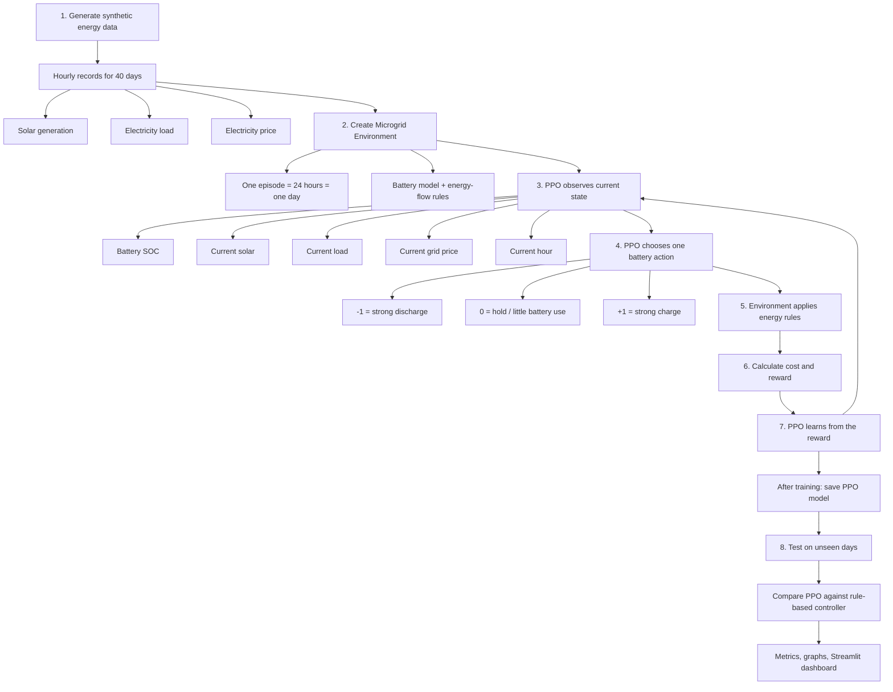
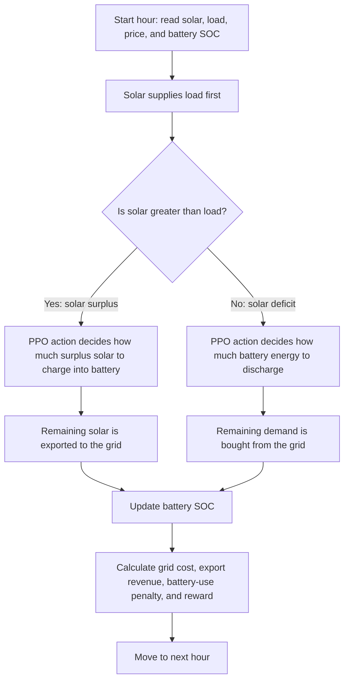
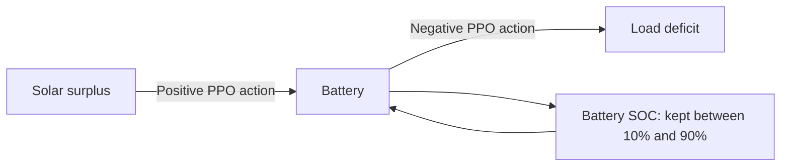
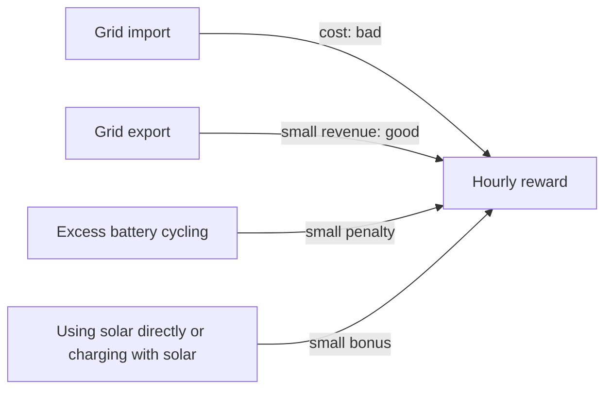
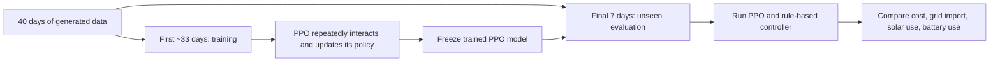
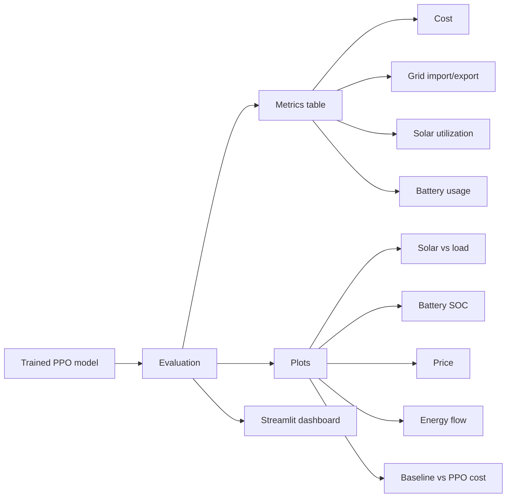

# Smart Microgrid RL — Project Working Flow

This document explains how the project works from data generation to final results.

## Complete project flow



## What happens in one hour?



## Example: sunny afternoon

```text
Solar = 4.8 kWh
Load  = 2.1 kWh

1. Solar directly serves the load: 2.1 kWh
2. Solar surplus: 2.7 kWh
3. PPO gives a positive action
4. Battery charges with the allowed amount of surplus
5. Any solar left over is exported to the grid
6. Battery SOC is increased after 95% charging efficiency
```

## Example: expensive evening hour

```text
Solar = 0.0 kWh
Load  = 3.0 kWh
Price = high

1. There is no solar, so the load has a 3.0 kWh deficit.
2. PPO may give a negative action to discharge the battery.
3. Battery supplies as much as it safely can.
4. The grid supplies only what remains.
5. Less grid import at a high price gives a better reward.
```

## Battery flow



Battery limits used in this project:

| Item | Value |
|---|---:|
| Capacity | 10 kWh |
| Starting SOC | 50% |
| Minimum safe SOC | 10% |
| Maximum safe SOC | 90% |
| Maximum charge rate | 5 kWh/hour |
| Maximum discharge rate | 5 kWh/hour |
| Charge/discharge efficiency | 95% |

## RL terms used in this project

| Term | Meaning here |
|---|---|
| Reinforcement Learning | Learning decisions by trying actions in a simulator and receiving a reward. |
| Agent | The PPO model that decides the battery charge/discharge action. |
| Environment | `MicrogridEnv`: the simulated solar, load, battery, grid, and price system. |
| State / observation | The information shown to PPO: SOC, solar, load, price, and hour. |
| Action | A number from `-1` to `+1`. Negative requests discharge; positive requests charge. |
| Reward | A score after every hour. Higher reward means a better energy-management decision. |
| Episode | One full simulated day of 24 hourly decisions. |
| Timestep | One hour in an episode. |
| Policy | The neural network inside PPO that maps the state to an action. |
| Training | Repeating many simulated days and updating PPO so it gets better rewards. |
| Evaluation | Running the already-trained PPO model on days it did not train on. |
| Baseline | The simple non-RL controller used as a fair comparison. |

## Why the reward makes sense



The reward is mainly based on money:

```text
reward = - cost of grid import
         + revenue from grid export
         - small battery-cycling penalty
         + small solar-use reward
```

So the agent gradually learns that buying grid electricity is undesirable—especially at expensive hours—and that battery energy should be used carefully.

## Training versus evaluation



The model is not given correct actions. It learns because actions that lower grid cost receive better rewards over many training episodes.

## Rule-based baseline flow

```text
If solar > load: charge battery as much as possible.
If solar < load: discharge battery as much as possible.
Otherwise: use the grid for anything left.
```

This rule does not learn from price or previous experience. PPO is evaluated against it on the same unseen days, using the same battery and energy rules.

## Output produced by the project


