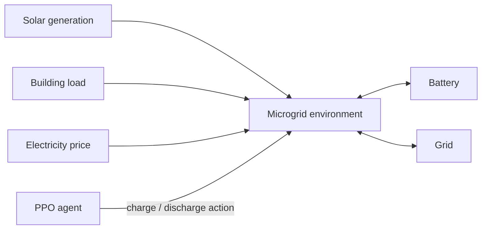

# AI-Based Smart Microgrid Energy Management Using Reinforcement Learning

A compact, runnable simulation in which a PPO agent learns hourly battery decisions for a solar-powered building. It minimizes net electricity cost while using solar energy and respecting battery limits. This is a simulation, not an IoT or hardware controller.



## Project layout

- `data/generate_data.py` — seeded synthetic 40-day hourly data generator.
- `environment/microgrid_env.py` — custom Gymnasium environment and battery/energy-flow logic.
- `training/train_ppo.py` — real Stable-Baselines3 PPO training.
- `evaluation/evaluate.py` — held-out comparison against a deterministic rule controller.
- `dashboard/app.py` — Streamlit day explorer.
- `utils/plots.py` — five Matplotlib charts.
- `tests/test_project.py` — data, reset/step, SOC and energy-balance tests.

## Environment

Each episode is one 24-hour day. PPO observes normalized `[battery SOC, solar generation, load, electricity price, hour]`. Its continuous action is in `[-1, 1]`: positive values request charging from solar surplus; negative values request discharge when solar cannot meet demand. Solar supplies load first. Remaining solar is charged or exported; remaining demand is supplied by the battery or imported from the grid.

The battery is 10 kWh, starts at 50% SOC, has 10–90% usable SOC, 5 kWh/hour charge/discharge limits, and 95% efficiency each direction.

## Reward

At each hour the environment optimizes:

`reward = - grid_import × price + grid_export × price × 0.35 - 0.025 × (charge + discharge) - solar_waste + 0.02 × (solar_to_load + solar_to_battery)`

This makes imported peak-price energy expensive, credits exported energy conservatively, discourages needless cycling, and lightly favors direct renewable use. Battery constraints are physically clipped, so SOC cannot leave its safe range.

## Baseline and results

The baseline follows a fixed rule: charge maximally whenever solar exceeds load and discharge maximally whenever solar is short. PPO and the baseline are both evaluated over the final seven data days, never the training days. Results are calculated when you run evaluation and saved to `plots/evaluation_summary.csv`; no performance result is invented or hardcoded.

## Run

Use Python 3.11+.

```bash
pip install -r requirements.txt
python main.py --generate-data
python main.py --train --timesteps 50000
python main.py --evaluate
# or perform all four stages:
python main.py --all --timesteps 50000
streamlit run dashboard/app.py
pytest -q
```

`--timesteps` is configurable; 50,000 is the default laptop-friendly demonstration run. The seed for data is configurable with `--seed`.

## Interview talking points

Explain that PPO improves a neural policy through repeated simulated day rollouts: each action produces an economic reward, and PPO updates the policy while limiting update size for stable learning. The policy is not scripted; it acts from the five observation values. Emphasize the held-out baseline comparison, realistic state constraints, and why an export tariff lower than the retail price gives the battery genuine scheduling value.

## Future improvements

Real weather data, wind generation, EV charging, real-time tariffs, multi-agent RL, digital-twin integration, and IoT hardware interfaces.
